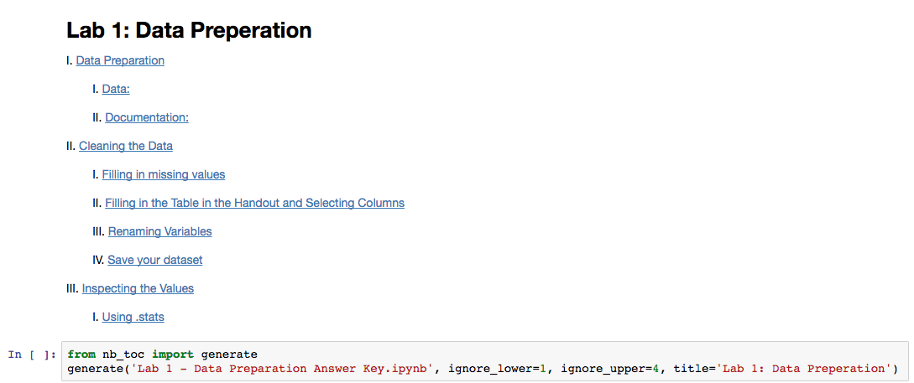

# nb_toc

Creates internal hyperlinks to make navigating large notebooks quicker.

## Usage

```python
from nb_toc import generate
generate('my_notebook.ipynb')
```

It is possible to run this in a notebook while it is open, but make sure to save beforehand. Possible to use as a pre-commit hook.

## Optional Parameters for `generate`

Argument | Default Value | Role
--- | --- | ---
`title` | 'Table of Contents' | Header for TOC cell
`additional_text` | None | Text at end of TOC cell
`indent_size` | 8 | Amount of indentation for TOC
`ignore_lower` | 0 | Ignores headers <= this number
`ignore_upper` | 7 | Ignores headers >= this number

## Example TOC

